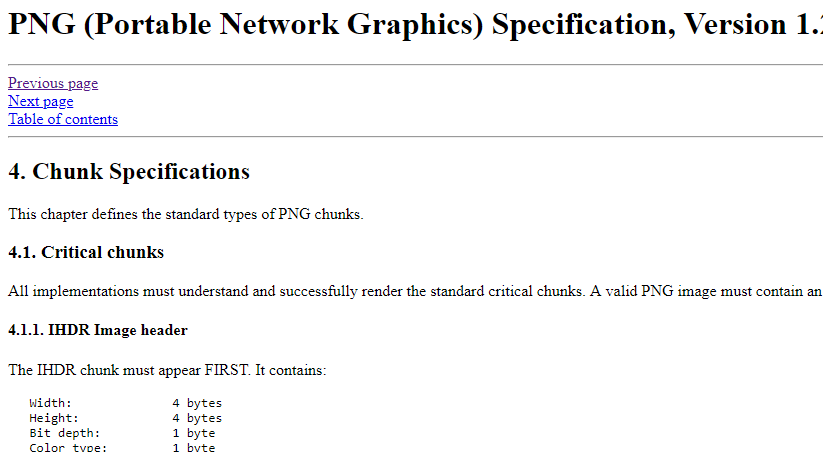
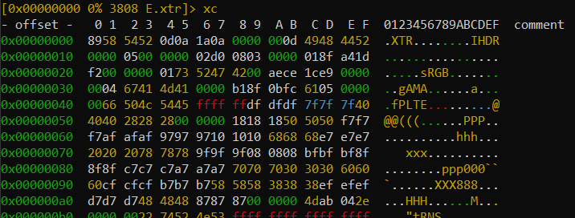
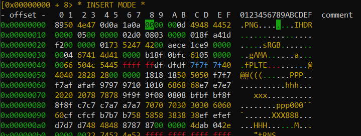
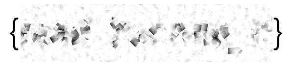

# Editing magic bytes with Radare: Example
Let's take a look at a peaCTF 2019 problem: E.xtr
We are given a file called E.xtr, and the only hint is "Flag is formatted as {plain_text}"

Let's take a quick look, shall we?
### Initial Analysis
One of the first things I tend to do is use the tools [binwalk](https://github.com/ReFirmLabs/binwalk) and [exiftool](https://www.sno.phy.queensu.ca/~phil/exiftool/) to try and analyze the file.

```
$ binwalk E.xtr

DECIMAL       HEXADECIMAL     DESCRIPTION
--------------------------------------------------------------------------------
251           0xFB            Zlib compressed data, compressed
```

```
$ exiftool E.xtr
ExifTool Version Number         : 11.35
File Name                       : E.xtr
Directory                       : .
File Size                       : 5.9 kB
File Modification Date/Time     : 2019:07:26 09:47:14-04:00
File Access Date/Time           : 2019:07:26 09:49:51-04:00
File Inode Change Date/Time     : 2019:07:26 09:47:14-04:00
File Permissions                : rwxrwxrwx
Error                           : Unknown file type
```

No dice. "zlib compressed data" shows up in a lot of files, and isn't much help here. Exiftool isn't showing anything special.

Since that didn't work, let's look closer. If we call strings on the file, hopefully we can find additional information.

```
$ strings E.xtr
IHDR
sRGB
gAMA
fPLTE
@@@(((
   xxx
ppp000
XXX888
"tRNS
        pHYs
IDATx^
--Lots of gobbledygook here--
IEND
```

Now I've already cracked open enough files to recognize some of the strings in here, but let's assume you have no idea what any of this is.

Whether you're viewing using strings or vim or radare or whatever, some specific lines should stick out such as IHDR, sRGB, gAMA, IDAT, and IEND.

Looking up any of these on their own is fruitless, but if you prepend "file" to your search, you get better results. Looking up "[file IHDR](https://duckduckgo.com/?q=file+IHDR&atb=v129-1&ia=web)", the first result we get is the [specification for .PNG files](http://www.libpng.org/pub/png/spec/1.2/PNG-Chunks.html).



So we have a .PNG file, but why doesn't anything see it as one? You can search the .PNG specification to find out, but to make it plain: magic bytes. These are bytes which files use to identify themselves. Without the bytes, most file viewers have no idea what they are looking at.

What are the magic bytes of a .PNG? Looking through the .PNG specification we found earlier, we can find the [following section](http://www.libpng.org/pub/png/spec/1.2/PNG-Structure.html):
```
3.1. PNG file signature
The first eight bytes of a PNG file always contain the following (decimal) values:

   137 80 78 71 13 10 26 10
This signature indicates that the remainder of the file contains a single PNG image, consisting of a series of chunks beginning with an IHDR chunk and ending with an IEND chunk.
```

There it is! Now let's edit the file with [radare](https://github.com/radare/radare2) to put these values in.

### Editing
Opening radare (in write mode, so we can edit):
```
r2 -w E.xtr
```
Let's now open Visual Mode
```
[0x00000000]> V
```
We are presented with the following screen:


Simply press i to enter edit mode, and a cursor will appear. Let's insert the values!
The values provided to us were in decimal, so we will need to translate them into hexadecimal values for us to insert. Or you could just look at the [magic bytes compendium on wikipedia](https://en.wikipedia.org/wiki/List_of_file_signatures) and find it there.
```
89 50 4E 47 0D 0A 1A 0A
```
Just move your cursor to the start block and type in these bytes (2 at a time)

The result should look like this:


Press escape a few times until you result to the command prompt, then type 'quit' to exit radare.

Just rename the file to something.png and you can open it! Image sensored for go-do-it-yourself's sake. The original file is included in this repo.

